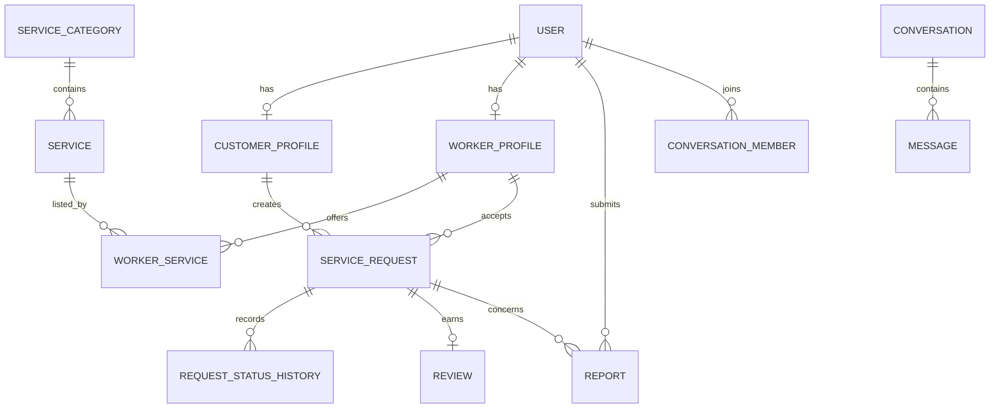

# SevaSetu data model

Core tables use UUID primary keys, `createdAt`, `updatedAt`, soft deletion where history must survive, foreign keys, and indexes for tenant/role/status/time queries.

Initial Prisma entities: `User`, `CustomerProfile`, `WorkerProfile`, `ServiceCategory`, `Service`, `WorkerService`, `ServiceRequest`, `RequestStatusHistory`, `Conversation`, `ConversationMember`, `Message`, `Review`, `Report`, `Verification`, `Notification`, `SavedWorker`, `Address`, and `AuditLog`. Future payment entities remain isolated behind a payments module.